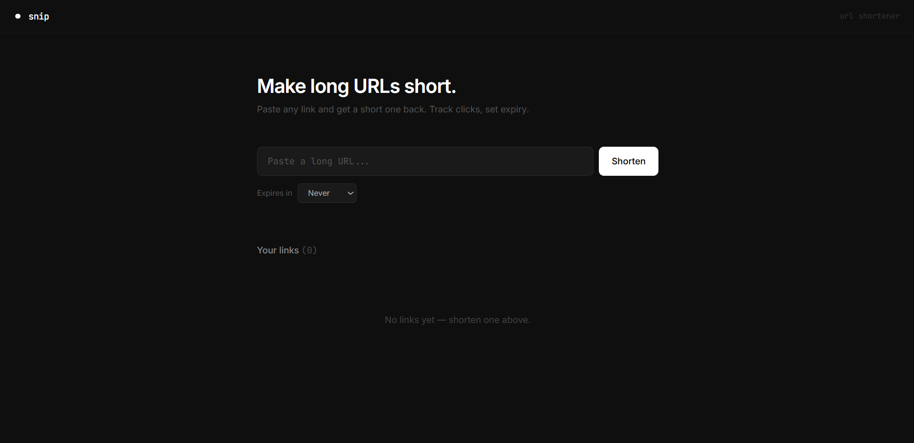
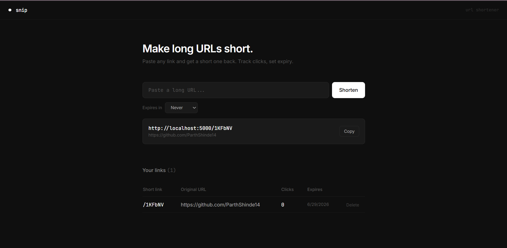

# Snip — URL Shortener

A full-stack URL shortener built with React, Node.js, Express, MySQL, and Redis. Paste any long URL and get a short one back instantly. Track clicks, set expiry dates, and manage all your links from a clean dashboard.

## Screenshots

### Home Page



### Analytics



## Tech Stack

| Layer    | Tech                        |
| -------- | --------------------------- |
| Frontend | React + Vite + Tailwind CSS |
| Backend  | Node.js + Express           |
| Database | MySQL                       |
| Cache    | Redis                       |

## Features

- Shorten any URL instantly
- Redis caching for fast redirects
- Click tracking per link
- Link expiry (1 day / 7 days / 30 days / never)
- Dashboard to manage and delete links
- Rate limiting on the API

## Project Structure

```
url-shortener/
├── README.md
├── docker-compose.yml
├── .gitignore
│
├── backend/
│   ├── package.json
│   ├── .env.example
│   └── src/
│       ├── index.js                  # Entry point
│       ├── config/
│       │   ├── db.js                 # MySQL connection pool
│       │   └── redis.js              # Redis client
│       ├── controllers/
│       │   └── url.controller.js     # Business logic
│       ├── routes/
│       │   └── url.routes.js         # API routes
│       └── middleware/
│           └── rateLimit.js          # Rate limiter
│
└── frontend/
    ├── package.json
    ├── vite.config.js
    ├── tailwind.config.js
    ├── index.html
    └── src/
        ├── App.jsx
        ├── main.jsx
        ├── index.css
        ├── hooks/
        │   └── useApi.js             # API calls
        └── components/
            ├── ShortenForm.jsx       # URL input form
            ├── ResultCard.jsx        # Shortened link display
            └── LinkTable.jsx         # Dashboard table
```

## API Endpoints

| Method   | Endpoint           | Description                |
| -------- | ------------------ | -------------------------- |
| `POST`   | `/api/shorten`     | Shorten a URL              |
| `GET`    | `/:code`           | Redirect to original URL   |
| `GET`    | `/api/links`       | Get all links              |
| `DELETE` | `/api/links/:code` | Delete a link              |
| `GET`    | `/api/stats/:code` | Get click stats for a link |

## Setup

### Prerequisites

- Node.js 18+
- MySQL running locally
- Redis running locally (optional — app works without it)

### Backend

```bash
cd backend
npm install
cp .env.example .env    # Fill in your MySQL credentials in .env
npm run dev
```

### Frontend

```bash
cd frontend
npm install
npm run dev
```

Open http://localhost:5173

## How It Works

Shorten a URL

1. User pastes a long URL into the form
2. Frontend sends POST /api/shorten to the backend
3. Express validates the URL and generates a 6-char nanoid code
4. The mapping is saved to MySQL with optional expiry
5. The result is also written to Redis cache (1 hour TTL)
6. The short URL is returned and displayed to the user

Redirect

1. Someone visits yoursite.com/abc123
2. Express checks Redis first — cache hit = instant redirect (~1ms)
3. If not cached → look up MySQL → cache it → redirect
4. Click count is incremented in the database
